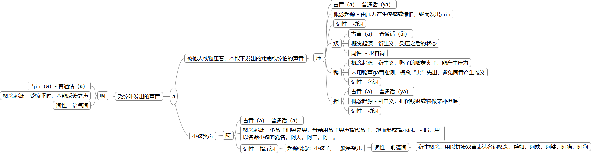

# 元音a系列本音分析

## a

### 音源

1. 被他人或物压着，本能下发出的疼痛或惊怕的声音
2. 受惊吓发出的声音
3. 小孩哭声

### 核心概念

| 文字 | 音源 | 古音 | 普通话 | 概念类型 | 概念起源 | 起源词性 | 常用语 | 父概念 | 子概念 |
|---|---|---|---|---|---|---|---|---|---|
| 压 | 1 | ā | yā | 第一 | 由压力产生疼痛或惊怕，继而发出声音 | 动词 | 压住；压杀（压死）；| N/A | 矮，押，鸭 |
| 矮 | 1 | ǎ | ǎi | 衍生 | 受压之后的状态 | 形容词 | 矮到这（很矮）；矮脚狗（短脚狗）；| 压 |
| 押 | 1 | ā | yā | 引申 | 扣留钱财或物做某种担保 | 动词  | 押债；抵押；| 压 |
| 鸭 | 3，1 | ā | yā | 特征 |   1. 鸭gua gua声如婴儿，关联“阿”的本义，主要根据俗语“鸭沥沥”，鸭嘴流口水样是婴儿的常见特征。  2. 鸭子的嘴象夹子，能产生压力 | 名词  | 鸭沥沥（鸭）；| 1. 阿；2. 压；|
| 啊 | 2 | a | a | 第一 | 受惊吓时，本能反馈之声 | 语气词 | 啊个嗲什（叹气个什么）| 1. 阿；2. 压；|
| 阿 | 3 | ā | ā | 第一 | 婴儿容易哭，母亲用婴儿哭声指代婴儿，继而形成指示词。因此，用以名命小孩的乳名，阿大，阿二，阿三。| 1.指示词 2.前缀词 | 1.阿大，阿二，阿三，2.阿姨，阿婆，阿猫，阿狗 | | 鸭 |

## ba

1. 爆裂之声
2. 断裂之声

### 发音口型特征

口型从闭合，急速张开至最大，爆发力强。

### 核心概念

1. 掰（ba - bai），用力撕开某物。
2. 拔（ba - ba），用力拉某物。
3. 白（ba - bai），蛋爆裂，蛋白之色。
4. 八（ba - ba），物体爆裂，溅射各处，概数，引申至数量八。
5. 百（ba|bo - bai），物体爆裂，溅射各处，概数，引申至数量百。八百，百转音至bo。
6. 摆（ba - bai），散开，引申于爆裂溅射；摆动，引申于祭拜动作。
7. 拜（ba - bai），跪拜，引申于摆祭品而后的祭拜仪式。
8. 败（ba - bai），东西碎裂，引申于爆裂溅射，俗语，败家精；失败，引申至队伍溃败之后四处逃离。

## ca

1. 打雷之声

### 发音口型特征

口型从闭合，抵齿，迅速张开，爆发力较强

### 核心概念

1. 叉（cā|cū - chā），此概念早于观天象，观察树木而来。
2. 插（cā - chā），闪电从一段迅速插入到另一端。
3. 擦（cā - cā），闪电迅速扫过天空。
4. 踩（cǎ - cǎi），踩在树杈上，引申于叉。
5. 拆（cā - chāi），分裂，引申于叉。

## da

1. 水滴掉落之声
2. 泥巴堆积之声

### 发音口型特征

口型从闭合，抵舌，迅速张开，爆发力较强。

### 核心概念

1. 撘（da - da），堆积，附着，引申于堆泥行为。
2. 戴（da - dai），引申于撘。
3. 瘩（da - da），突起，引申于堆泥行为。
4. 达（da - da），累高，引申于堆泥行为，词语，发达；引申义，恒通。
5. 无字, 用力把泥巴摔到地上, 引申义，甩打。
6. 答（da - da），回应，引申于水滴di da双音前后回应。
7. na da（捺撘），捏泥，撘泥，摔打泥巴，引申为赃物。

## ga

1. 坚果类硬物受力破裂之声
2. 坚硬枝干受力断裂之声
3. 鸡叫声（go go ga）
4. 鸭叫声（ga ga ga，gua gua）

### 发音口型特征

口型从闭合，舌胎抵上颚，闭气，迅速张开，爆发力较强。

1. 夹|胳（ga - jia），两边施加强力，形成中间压力。俗语，夹子；胳肢窝。
2. 介（ga - jie），处于中间，引申于夹。俗语，间介（尴尬）。
3. 隔|格|膈|革（ga - ge），被中间之物分离，引申于介。俗语，隔夜头，昨天晚上；皮革（格|隔）子，皮夹。
4. 轧（ga - ga），引申于夹，受压力而脱谷物。

## ha

1. 开怀大笑之声

### 发音口型特征

口型非常大，始终开口。

### 核心概念

1. 哈（ha - ha），笑声，象声词。
2. 蟹（ha - xie），螃蟹腹部形似人张口大笑之形，公蟹尖脐如人口中小舌。
3. 瞎（ha - xia），引申义，一种游戏，遮住眼睛，左右似螃蟹横着走抓人。
4. 无字（ha），螃蟹整体形状似手掌，引申用手掌打。
5. 鞋（ha - xie），引申义，螃蟹移动，鞋用以移动的功能性。

## ka

1. 硬物断裂之声，相对ga爆发力弱。

### 发音口型特征

口型从闭合，舌胎抵上颚，闭气，迅速微张开，爆发力一般。

### 核心概念

1. 甲（ka - jia），指甲断裂之声。名词，指甲；动词，用指甲刻物。俗语，手指甲。
2. 客（ka - ke），甲气（客气），舒服。？
3. 卡（ka - ka）
4. 无（ka），擦洗。俗语，ka面，洗脸。

## ma

1. 最简单的发音方式，小孩本能发音。
2. 母亲模仿小孩吸奶口型所发之音（ma mu），引导小孩吸奶。

### 发音口型特征

口开始时闭合，张开时发ma，闭合时以mu音收尾。

### 核心概念

1. 妈（ma - ma），喂奶行为频率极高，形成指示代词。
2. 埋（ma - mai），填入，引申义，小孩吸奶时，奶头陷入小孩口中。
3. 抹（ma - mai），摩擦，引申义，小孩吮吸时，上下挤压摩擦乳头。俗语，抹布。
4. 麦（ma - mai），引申义，麦子需要摩擦方式去壳。
5. 买|卖（ma - mai），待考究，一种可能，麦子是当时最重要的交易物品。

## pa

1. 爆裂之声，相对于ba爆发力弱。
2. 表面积较大之物相碰之声，如击掌之声。

### 发音口型特征

口型从闭合, 凝气，迅速微张开，爆发力一般。

### 核心概念

1. 拍（pa - pai），衍生于击打之声。

## cya

1. 低空近身雷之声，频率非常高，声音尖锐，清脆。

### 发音口型特征

口型从闭合，抵齿，凝气，迅速微张，爆发力极强。

### 核心概念

1. 切（cya - qie），引申于闪电撕裂天空。
2. 契（cya - qi），雕刻，雕琢，引申于切。
3. 雀（cya - que），引申于鸟啄食似契。
4. 恰（cya - qia），瞬间，引申于闪电迅速闪过。
5. 且（cya - qie），分割，引申于闪电分割天空，形成并列关系。
6. 妾？

## sa

1. 蛇出击时所发之声

### 发音口型特征

口型从闭合，抵齿，凝气，迅速张开，爆发力强。

### 核心概念

1. 杀（sa - sha），引申于蛇的致命效果，本义为死。俗语，戳杀，刺死。
2. 洒|撒（sa - sǎ），引申于蛇的喷毒，一般为眼镜蛇。
3. 蛇（sa - she），衍生于蛇攻击时所发之声。
4. 射（sa - she），衍生于蛇攻击时的投射动作。
5. 眨（sa - zha），眼皮快速张合，衍生于蛇攻击时快速的动作。俗语，瘪眨瘪眨，眨眼不知所措。
6. 刹（sa - cha），迅速，瞬间，衍生于蛇攻击时快速的动作。俗语，有刹，刚才。

## ta

1. 鞋子拖沓之声，尤其在泥水中行走，爆发力一般。
2. 雨水或者水滴掉落湿泥地上之声。

### 发音口型特征

口型从闭合，抵齿，凝气，微张开，爆发力一般。

### 核心概念

1. 太（ta - tai），密密麻麻，极多之义，引申于下雨时雨滴数量。
2. 泰（ta - tai），高耸，引申于太。
3. 塌（ta - ta），被雨水冲刷，墙体流失掉。
4. 塔（ta - ta），周之后概念，未符合夏商创造概念逻辑。合理推断，引申于太或泰。

## wa

1. 哭声
2. 惊讶之声

### 发音口型特征

口型从闭合，迅速张开，口型非常大。

### 核心概念

1. 娃（wa - wa），衍生于小孩哭声。
2. 挖（wa - wa），引申于小孩哭时的大嘴型，坑状。
3. 外（wa - wai），穴居时代，洞口为外，引申于小孩哭时口型似洞口。待考究，与“外”对应的概念“里”。
4. 歪（wa - wai），引申于外，外人，不熟悉而防备之人。

## za

1. 石头撞击之声
2. 打雷之声

### 发音口型特征

口型从闭合，抵齿，凝气，迅速张开，爆发力强。a：音比a音拖长。

### 核心概念

1. 着（za - zhao），击中而着火，衍生于被闪电击中而起火。
2. 砸（za - za），衍生于石头撞击。
3. 石（za - za），衍生于砸石头行为。
4. 杂（za - zha），溅射，衍生于石头撞击时颗粒飞溅。引申为，多而乱。
5. 榨（za： - zha），引申于砸，用工具撞击获取汁液。
6. 柴（za： - chai），引申于着，可以生火之物。